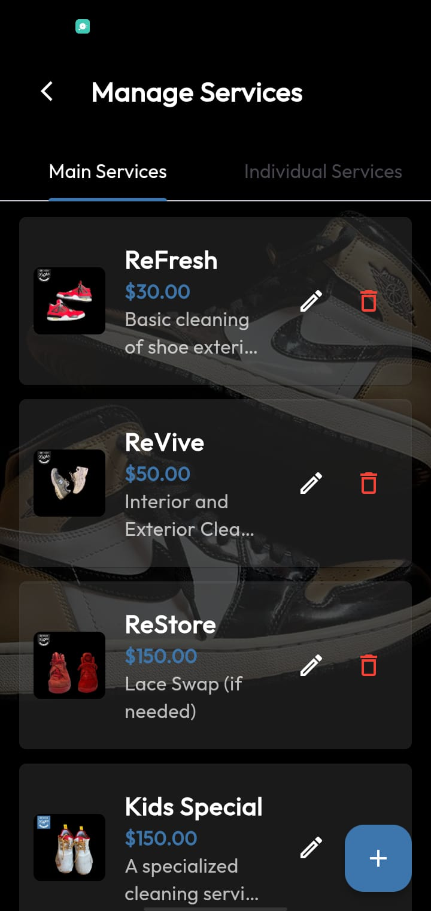

# RFK_Admin

Admin App for RefreshKicks (A shoe cleaning service)

It includes: 
- Admin Dashboard
- Services Management
- Orders Management
- User Management
- Business Analytics
  
#### App Screenshots

<table>
  <tr>
    <td>Admin Dashboard</td>
     <td>Manage Services</td>
     <td>Edit Service</td>
     <td>Manage Users</td>
  </tr>
  <tr>
    <td></td>
    <td></td>
    <td></td>
    <td></td>
  </tr>
   
  <tr>
    <td>Filters Screen</td>
     <td>Favorites Screen</td>
     <td>Drawer</td>
  </tr>
  <tr>
    <td></td>
    <td></td>
    <td></td>
  </tr>
 </table>
