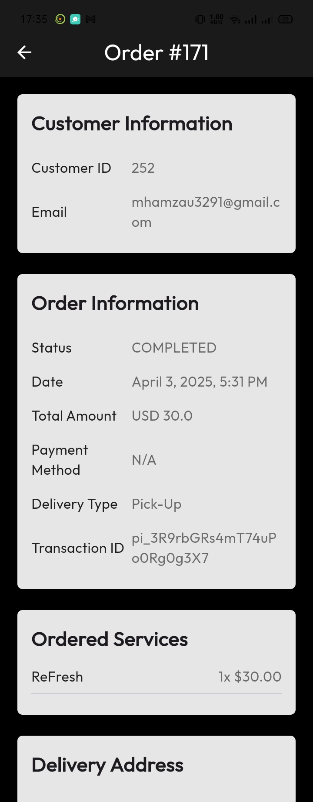
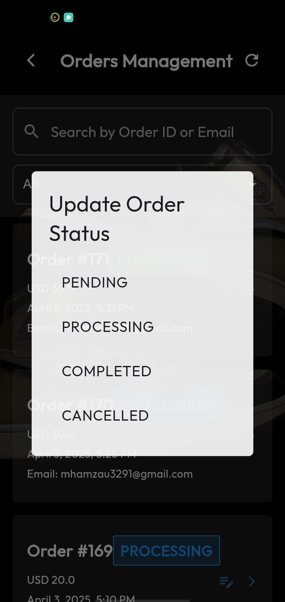

# RFK_Admin

Admin App for RefreshKicks (A shoe cleaning service)

It includes: 
- Admin Dashboard
- Services Management
- Orders Management
- User Management
- Business Analytics
  
#### App Screenshots

<table>
  <tr>
    <td>Admin Dashboard</td>
     <td>Manage Services</td>
     <td>Edit Service</td>
     
  </tr>
  <tr>
    <td></td>
    <td></td>
    <td></td>
    
  </tr>
   
  <tr>
    <td>Manage Orders</td>
    <td>Order Details</td>
     <td>Update Order Status</td>

  </tr>
  <tr>
    <td></td>
    <td></td>
    <td></td>
  </tr>

  <tr>
    <td>User Management</td>
     <td>User Details</td>
     <td>Business Analytics</td>
     
  </tr>
  <tr>
    <td></td>
    <td></td>
    <td></td>
    
  </tr>
   
  <tr>
    <td>Orders Chart</td>
    <td>Revenue by Service</td>
    <td>Daily Revenue</td>
     

  </tr>
  <tr>
    <td></td>
    <td></td>
    <td></td>
  </tr>
 </table>
